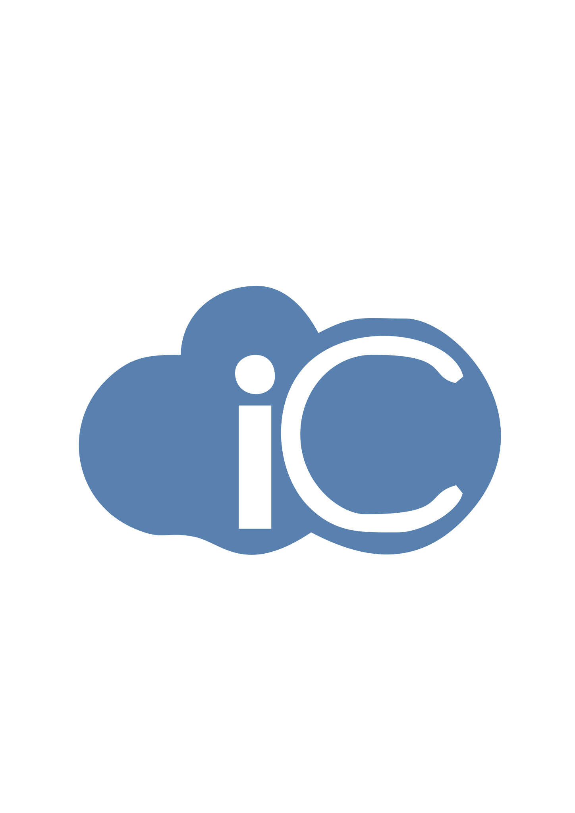

<p align="center">
   
   <p align="center">
        
         
        
    </p>
</p>

# Iclouds Teste Estágio

---

- [📝 Descrição](#📝-Descrição)
- [⚙️ Tecnologias](#⚙️-Tecnologias)
- [API Utilizada](#API-Utilizada)
- [🚀 Desafios](#🚀-Desafios)
- [💡 Melhorias](#💡-Melhorias)
- [📦 Arquitetura](#📦-Arquitetura)
- [📥 Instalação](#📥-Instalação)

# 📝 Descrição

App desenvolvido em ReactJS seguindo o layout proposto e preenchendo algumas informações de acordo com a API proposta. O objetivo desse teste é avaliar se estou apto a vaga de estágio, avaliando  minhas habilidades em:
- Organização e documentação do código;
- Facilidade de manutenção posterior;
- Domínio e performance na linguagem;
- Fidelidade ao design, quando se diz sobre o posicionamento dos elementos;
- Domínio de ReactJs
-  Domínio de CSS;
- Estrutura do projeto;

# ⚙️ Tecnologias

- Javascript
- React

# API Utilizada

- Google Books API

    Api da Google para busca de livros.

# 🚀 Desafios

- Criar um layout responsivo respeitando o original proposto.

# 💡 Melhorias

- Acredito que poderia melhorar os componentes criados, outros meios disponibilados pelo React.
- A responsividade pode ser aprimorada.
- Acredito que poderia melhorar a forma de receber as informações vinda da API.

# 📦 Arquitetura

```shell
src/
|-- assets/ # Contém os arquivos que agregam na interface da aplicação.
|-- assets/styles/ # Diretório dos estilos globais.
|-- components/ # Contém todos os componentes e seus estilos.
|-- services/ # Configurações de conexão a api e serviços externos.
```

# 📥 Instalação

**Você vai necessitar instalar o [Node.js](https://nodejs.org/en/download/) e [Yarn](https://yarnpkg.com/), então clone o repo, utilizando este comando:**

`git clone git@github.com:lucasbdias/Iclouds-teste.git`

**Instale as dependências do projeto:**

`npm install`

ou

`yarn`

Para rodar o projeto em ambiente de desenvolvimento, utilize o comando:

`npm run dev`

ou

`yarn dev`

---

Contato: lucasbrzdias@gmail.com